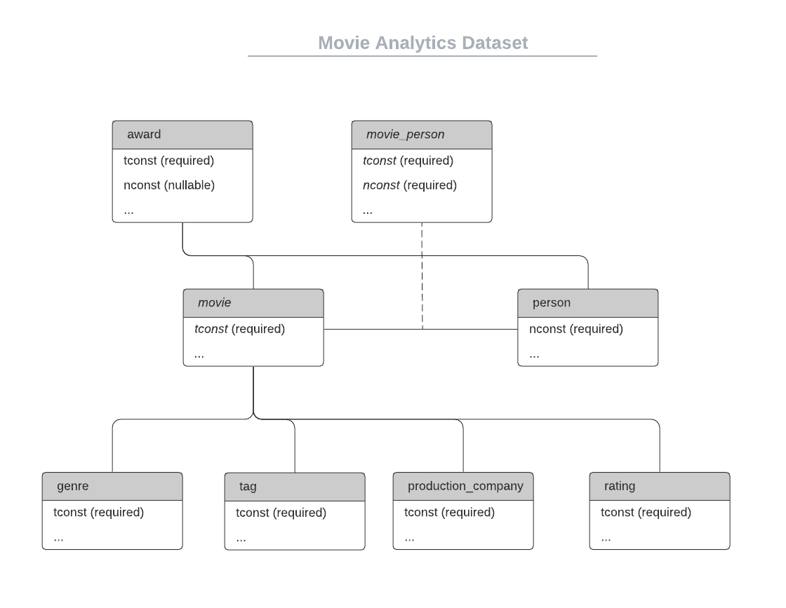
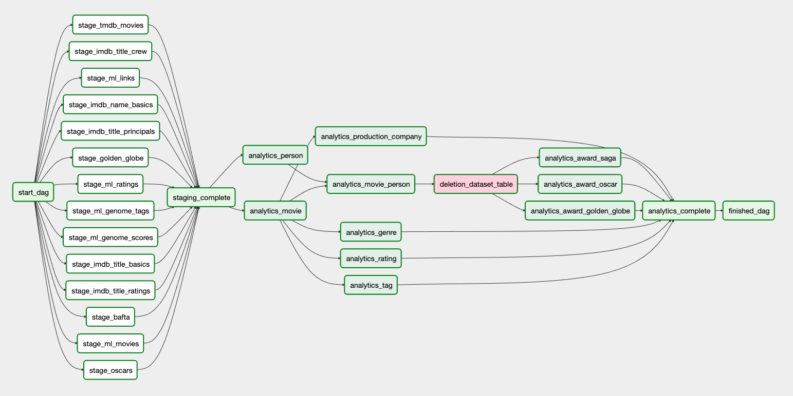

# Movie Analytics Pipeline
Author: Edgar Tanaka

## TL;DR
This is the capstone project of the Udacity Data Engineering Nanodegree. 

I have built a data pipeline that collects movie data from disparate datasets and creates a Movie Analytics
dataset for adhoc insights.

## Important message for Udacity reviewers 
Point 1: This project was built on top of Google Cloud Platform instead of AWS. 
Redshift had some serious performance issues while I was loading JSON files. Bigquery serves the same purpose
 as Redshift would.

Point 2: the code to be reviewed is in `src/airflow`. You can ignore `src/gcp` and `src/aws`.

## Technologies used
- Python 3.7.2
- Apache Airflow 1.10.10
- Google Cloud Storage
- Bigquery
- For data analysis: 
    - Jupyter Notebook
    - Matplotlib

## Step 1: Scope the Project and Gather Data
IMDB seems to be already established as a source of truth database for movies metadata. 
Even so, this catalog has been enriched with data such as tagging, genre, rating, awards, revenue and production companies. 
This enrichment expands the insights that could be extracted by a data analyst. 

Adult movies and TV series are considered out of the scope of this project.

### Use cases
Here I have outlined some questions that could be answered by querying the Movie Analytics dataset:
- What genres are the most common among the top 1000 movies with the highest profit?
- Is there a trend in most popular genres?
- Do we have more LGBT related movies now than in the past? How are they rated?
- What genres have won the most Oscars in history?
- What genres are the best rated?

## Step 2: Explore and Assess the Data

### The Datasets
- [IMDB](https://www.imdb.com/interfaces/)
- [MovieLens](https://grouplens.org/datasets/movielens/)
- [TMDB](https://developers.themoviedb.org/3)
- [The Oscars (Kaggle)](https://www.kaggle.com/unanimad/the-oscar-award)
- [Golden Globe Awards (Kaggle)](https://www.kaggle.com/unanimad/golden-globe-awards)
- [Bafta Awards (Kaggle)](https://www.kaggle.com/unanimad/bafta-awards)
- [SAGA - Screen Actors Guild Awards (Kaggle)](https://www.kaggle.com/unanimad/screen-actors-guild-awards)

Data can easily be dowloaded for IMDB, MovieLens and the Kaggle datasets. 
Note that the Kaggle datasets are not official. They were scraped by someone and published on the Kaggle
platform.

The TMDB though was trickier to get as it's offered as an API. I had to write a [python script](https://gist.github.com/edgartanaka/a1bc5a0d7bb843f19b62669cd9bb3f8e)
to download all of the movies data. I have shared this [data on Kaggle](https://www.kaggle.com/edgartanaka1/tmdb-movies-and-series)
so that anyone interested in movies data can make use of it. Each movie was downloaded from the API and saved as a
JSON file. More than 500K files are within this generated dataset. 

### Datasets in size and format
| Dataset            | Table            | Rows count | Format |
|--------------------|------------------|------------|--------|
| IMDB               | name.basics      | 10,218,303 | TSV    |
| IMDB               | title.basics     | 6,974,101  | TSV    |
| IMDB               | title.crew       | 6,974,101  | TSV    |
| IMDB               | title.principals | 40,116,933 | TSV    |
| IMDB               | title.ratings    | 1,057,712  | TSV    |
| MovieLens (ml-25m) | genome-scores    | 15,584,449 | CSV    |
| MovieLens (ml-25m) | genome-tags      | 1,129      | CSV    |
| MovieLens (ml-25m) | links            | 62,424     | CSV    |
| MovieLens (ml-25m) | movies           | 62,424     | CSV    |
| MovieLens (ml-25m) | ratings          | 25,000,096 | CSV    |
| MovieLens (ml-25m) | tags             | 1,093,361  | CSV    |
| TMDB               | movies           | 526,563    | JSON   |
| Oscars             | oscars           | 10,396     | CSV   |
| Golden Globe       | golden globe     | 7,992      | CSV   |
| BAFTA              | bafta            | 4,177      | CSV   |
| SAGA               | saga             | 5,760      | CSV   |

## Step 3: Define the Data Model
The data model is somewhat normalized. Too much normalization would require too many joins in our queries.
On the other hand, no normalization at all, would create tables with lots of fields and in some cases nested 
fields. Some data analysts I have talked to may prefer that "all-in-one-table" approach but I have assumed
here that most users would prefer not having to deal with nested fields in Bigquery.

The main tables in this model are `movie`, `person` and the relationship 
`movie_person`. The other tables are enrichments on top of those (specially movie). Even though the relationship
between `movie` and `genre`, `tag`, `production_company`, rating are 1-to-many, I have decided to keep them separate
so not to bloat the `movie` table with too many fields. Also, I have decided as a general rule not to use 
nested fields in any of the tables so that queries are simple and so that data analysts wouldn't have
to figure out how to query nested fields.

# TODO: review
Here are some principles that guided the data model:
- consistency for fields: always snake case
- No internal IDs are created. IMDB `tconst` (for movies) and `const` (for people) are the only IDs used.
- IMDB database is the source of truth. If any consolidation was needed, IMDB always had higher priority.
- If data from other datasets for enrichment lacked tconst, it was discarded.
- Flat tables. No nested fields. Querying nested fields can be a barrier for some data analysts so I have
decided to normalize these cases.

Below, you can find a diagram of the data model where only the IDs have been specified as fields.
The complete data dictionary is defined further down this section 



### Data Dictionary
#### Award
| Field name     | Type    | Description                                                                                                             |
|----------------|---------|--------------------------------------------------------------------------------------------------------------|
| award_name     | STRING  | Name of the event for award. Valid values are `oscars`, `saga` and `golden_globe`                            |
| award_year     | INTEGER | Year when award was granted                                                                                  |
| award_category | STRING  | Category of the award such as "Best actor" or "Best director". This category name depends on the award_name. |
| award_winner   | BOOLEAN | Name of the movie or name of the person who won the award                                                    |
| film           | STRING  | Name of the movie                                                                                            |
| person_name    | STRING  | Name of the person or people who received the award                                                          |
| tconst         | STRING  | Movie ID                                                                                                     |
| nconst         | STRING  | Person ID                                                                                                    |

#### Genre
| Field  | Type   | Description                                                                                                                            |
|--------|--------|----------------------------------------------------------------------------------------------------------------------------------------|
| tconst | STRING | Movie ID                                                                                                                               |
| genre  | STRING | Genre name such as "drama", "action", "thriller". This is a combination of genres from IMDB and MovieLens. All genres are lower cased. |

#### Movie
| Field name        | Type    | Description                                                                                                                                                                                                                                                        |
|-------------------|---------|--------------------------------------------------------------------------------------------------------------------------------------------------------------------------------------------------------------------------------------------------------------------|
| tconst            | STRING  | Movie ID                                                                                                                                                                                                                                                           |
| movie_type        | STRING  | Type/Format of movie. Values can be "movie", "tvMovie" and "short". Definition of each can be found [here](https://help.imdb.com/article/imdb/discover-watch/how-do-you-decide-if-a-title-is-a-film-a-tv-movie-or-a-miniseries/GKUQEMEFSM54T2KT?ref_=helpart_nav_21#) |
| primary_title     | STRING  | The more popular title / the title used by the filmmakers on promotional materials at the point of release                                                                                                                                                         |
| original_title    | STRING  | Original title, in the original language                                                                                                                                                                                                                           |
| start_year        | STRING  | Format YYYY. Represents the release year of a title. In the case of TV Series, it is the series start year                                                                                                                                                         |
| end_year          | STRING  | REMOVE                                                                                                                                                                                                                                                             |
| runtime_minutes   | INTEGER | Primary runtime of the title, in minutes                                                                                                                                                                                                                           |
| budget            | INTEGER | Budget of the movie. This is null for some movies.                                                                                                                                                                                                                 |
| homepage          | STRING  | URL to movie's homepage.                                                                                                                                                                                                                                           |
| original_language | STRING  | Language in lower case. Some examples: "en", "it", "fr".                                                                                                                                                                                                           |
| overview          | STRING  | Synopsis of the movie.                                                                                                                                                                                                                                             |
| popularity        | NUMERIC | Popularity of the movie. Value can range from 0 to 176.614 (not restricted). This value comes from TMDB.                                                                                                                                                           |
| poster_path       | STRING  | Path to poster image in TMDB.                                                                                                                                                                                                                                       |
| release_date      | STRING  | Release date of the movie.                                                                                                                                                                                                                                         |
| revenue           | INTEGER | Revenue of the movie. This is null for some movies.                                                                                                                                                                                                                |
| status            | STRING  | Production status. Values are: "Released", "Post Production", "In Production", "Rumored", "Planned", "Cancelled" and null.                                                                                                                                         |
| tagline           | STRING  | Tagline of the movie announcement. Some examples: "For Vengeance, For Justice, For Love.", "Boy meets girl. Boy meets girl's cousin." "                                                                                                                            |


#### Movie Person (table `movie_person`)
| Field name          | Type    | Description                                                                                                                                                       |
|---------------------|---------|-------------------------------------------------------------------------------------------------------------------------------------------------------------------|
| tconst              | STRING  | Movie ID                                                                                                                                                          |
| nconst              | STRING  | Person ID                                                                                                                                                         |
| movie_primary_title | STRING  | The more popular title / the title used by the filmmakers on promotional materials at the point of release                                                        |
| person_primary_name | STRING  | Name by which the person is most often credited                                                                                                                   |
| ordering            | INTEGER | A number to uniquely identify rows for a given titleId                                                                                                            |
| category            | STRING  | The category of job that person was in. Examples: "actor", "actress", "self", "producer", "writer", "editor", "director", "composer". This field comes from IMDB. |
| job                 | STRING  | The specific job title if applicable, else null.                                                                                                                  |
| characters          | STRING  | The name of the character played if applicable, else null.                                                                                                        |


#### Person
| Field name         | Type    | Description                                                                                                      |
|--------------------|---------|------------------------------------------------------------------------------------------------------------------|
| nconst             | STRING  | Person ID. This person could be actor, actress, director, writer or other professional involved in movie making. |
| primary_name       | STRING  | Name by which the person is most often credited                                                                  |
| birth_year         | INTEGER | Year of birth in YYYY format                                                                                     |
| death_year         | INTEGER | Year of death in YYYY format. Null if not applicable.                                                            |
| primary_profession | STRING  | The top-3 professions of the person. Comma separate values.                                                      |
| known_for_titles   | STRING  | Titles the person is known for. Comma separated `tconst` IDs.                                                    |


#### Production Company (table `production_company`)
| Field name                 | Type   | Description                                                                                                 |
|----------------------------|--------|-------------------------------------------------------------------------------------------------------------|
| tconst                     | STRING | Movie ID                                                                                                    |
| production_company_name    | STRING | Name of production company. Examples: "Warner Bros. Pictures", "Columbia Pictures" and "Universal Pictures" |
| production_company_country | STRING | Country where production company is based. Examples: "US", "CA", "JP".                                      |


#### Rating
| Field name     | Type    | Description                              |
|----------------|---------|------------------------------------------|
| tconst         | STRING  | Movie ID                                 |
| imdb_rating    | FLOAT   | Rating in IMDB. Ranges from 0 to 10.0    |
| imdb_num_votes | INTEGER | Number of votes in IMDB                  |
| tmdb_rating    | NUMERIC | Rating in TMDB. Ranges from 0 to 10.0    |
| tmdb_num_votes | INTEGER | Number of votes in TMDB                  |
| ml_rating      | NUMERIC | Rating in MovieLens. Ranges from 0 to 5. |
| ml_num_votes   | INTEGER | Number of votes in MovieLens             |


#### Tag
| Field name | Type   | Description                                                                                                                                                                          |
|------------|--------|--------------------------------------------------------------------------------------------------------------------------------------------------------------------------------------|
| tconst     | STRING | Movie ID                                                                                                                                                                             |
| tag        | STRING | User created tag. This is a wildly broad field and can indicate themes, important actors/actresses, characters, awards (not exhaustive list).                                        |
| relevance  | FLOAT  | Relevance values are on a continuous 0-1 scale. A value of 1 indicates that a tag is strongly relevant to a movie and a value of 0 indicates that a tag has no relevance to a movie. |


## Step 4: Run ETL to Model the Data



### Steps
Staging steps
- create_bq_datasets: drops and recreates the final schema for analytics

- ml_stage.py: stages movielens data into redshift
- imdb_stage.py: stages all the data from IMDB into redshift
- tmdb_stage.py: stage TMDB data into redshift

- movie.py: loads data into `analytics.movie`
- genre.py: load table `analytics.genre` with data from IMDB, TMDB and movielens
- tag.py: loads data into `analytics.tag`

Consolidation steps
- consolidate genres: imdb, movielens, tmdb
- consolidate movielens + imdb

Validation steps

## Movie
Filtering/Cleaning
- removed adult movies
- removed anything but movies (only kept title where type was "movie", "tvMovie" or "short")

## Genre
Filtering/Cleaning
- removed genre != '(no genres listed)'

## The technologies chosen
**TODO**

## Thinking about other scenarios
### Scenario 1: If the data was increased by 100x.
We can break it down this question into 2 parts: reading data and writing data.

Let's start with reading data. How would an 100x increase affect the users of Movie Analytics after
all the data has been processed? The largest table in Movie Analytics contains 15M rows so if
this number increases linearly (worst case), we're talking about 1.5B rows. Bigquery can handle billions of records. 
This [article](https://cloud.google.com/blog/products/gcp/anatomy-of-a-bigquery-query) presents
results of Bigquery returning query results in 30 seconds on a table with 100 billion rows. Bigquery 
is still a sound solution for data analysts to do adhoc analysis on the final Movie Analytics dataset.

Now let's talk about writing data. How would that same increase affect the data pipeline execution and performance?
The largest CSV I staged had 40M rows so if data increased by 100x we'd be talking about 4 billion records.
As per the article referenced above, that's still within Bigquery's capabilities. Also, the entire pipeline
is currently taking around 5-6 minutes to run and Bigquery automatically scales the resources needed
to process the queries you send it. Loading the data to Storage took less than 30 minutes. Since all the data processing
is done on Bigquery, I wouldn't expect any changes in the pipeline with this increase.

If we did hit a performance issues, we should consider moving to Google Cloud Dataflow where the resources
are managed.

Cost is another aspect that could be considered in this analysis as well.

### Scenario 2: If the pipelines were run on a daily basis by 7am.
This project was built on top of Apache Airflow which allows scheduling. 
 I would set up a daily schedule for the job to run at 7am and set alerts to be triggered in case
 the job hadn't finished within 2 hours. 
A modification in the DAG to pull data directly from IMDB, TMDB, and MovieLens Kaggle would be needed.
For this project delivery, I have assumed that the data would be always available in Google Cloud Storage.

### Scenario 3: If the database needed to be accessed by 100+ people. 
I need more information to answer this question. 
- how is this access? how many requests per second would that be on the database?
- would I need to provide an API for these users?
- how sensitive is the latency for each request?
- what are the security constraints?

Let's assume we are talking about 100+ data analysts who do not have any time sensitive 
queries to run. Bigquery should still be the option to keep. It provides SQL interface which
is easy for data analysts and business analysts to use. It can handle hundreds of users easily. 
Bigquery also provides easy interfaces with Jupyter notebooks, Google DataStudio (for data visualization)
and data export features.

If this data had to be accessed by end users with a time sensitive use case (for example a web application
where we need to respond within milliseconds), then we should consider migrating this data to a relational
database. 100+ users can easily be handled by MySQL or PostgreSQL. We would need to do some analysis on the
queries that this web application would run on the database and tune the right indexes for optimal performance.
The DAG would have to modified to export data from Bigquery into PostgreSQL. We'd also have to consider the fact
that the web application could not have the performance penalyzed while it was being updated. 

## Lessons learned
- redshift has bad support for flattening
- redshift has bad support for json (very limited)

### Redshift is slow to load JSON files
Redshift couldn't load my 526631 records even after 4 hours running. Researching online, 
this seems to be related with the fact that there were many JSON files and there is some overhead
per file. I had the same performance issue in one of my Udacity labs.

On the other hand, BQ loaded all JSON files in about 4 minutes:
```
$time python stage_json.py 
/Users/edgart/.pyenv/versions/3.6.10/lib/python3.6/site-packages/pandas/compat/__init__.py:117: UserWarning: Could not import the lzma module. Your installed Python is incomplete. Attempting to use lzma compression will result in a RuntimeError.
  warnings.warn(msg)
Starting job 1b5af311-c363-4098-9a6a-c32041ba4dd5
Job finished.
Loaded 526631 rows.

real	4m7.194s
user	0m1.424s
sys	0m0.278s
```

## Next steps
Here are some next steps to continue improving this dataset:
- Enrich Movie Analytics even more with the BAFTA dataset. Currently it has some severe inconsistencies which are 
a bit hard to deal with programmatically.
- 